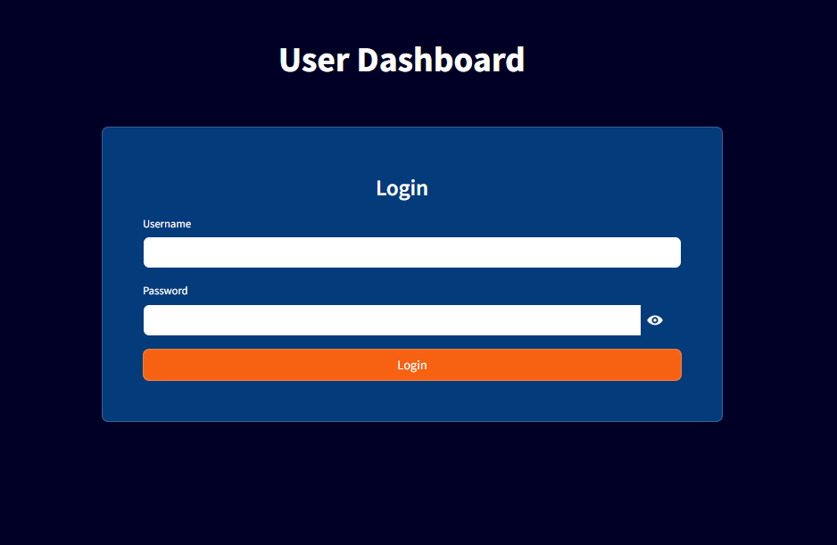
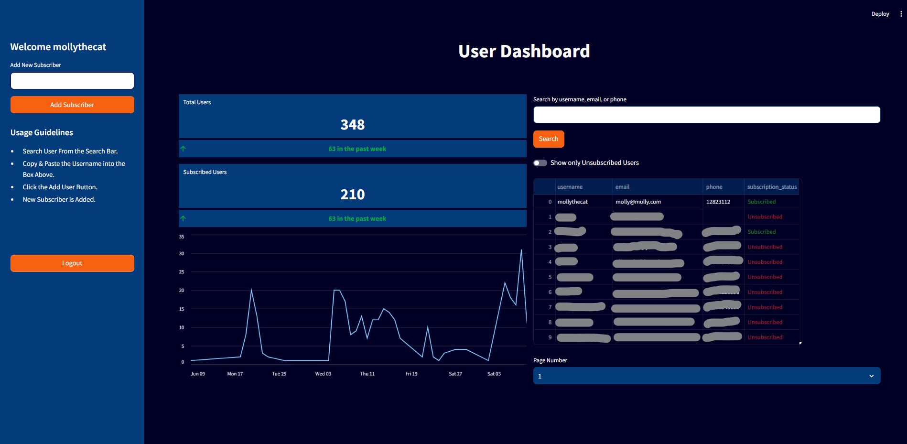
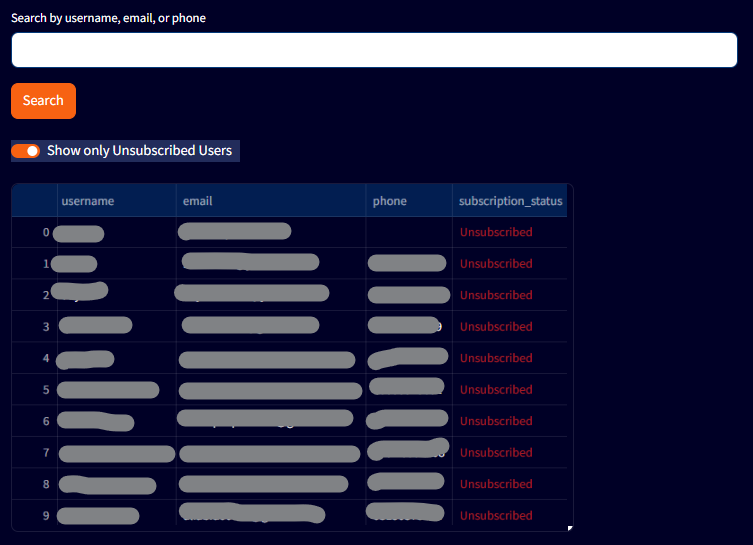
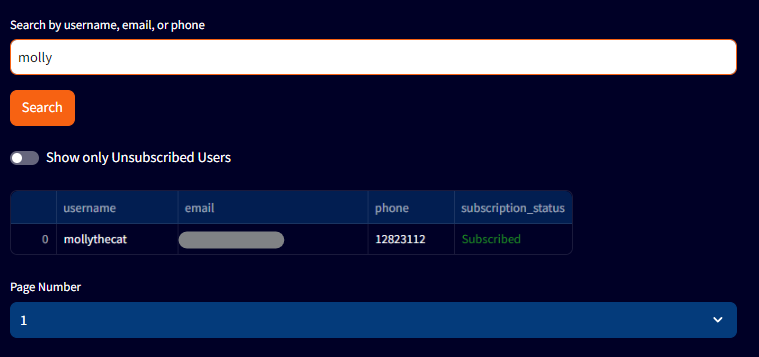
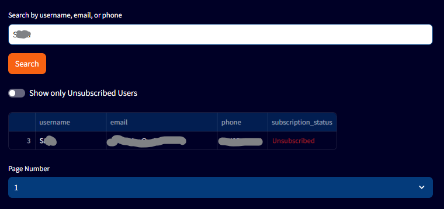
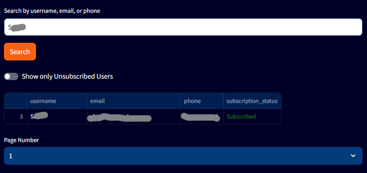
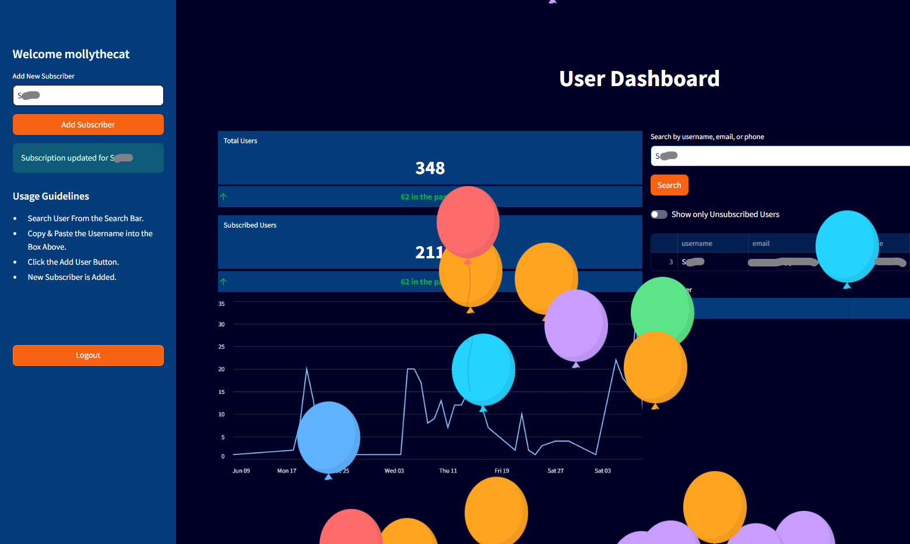

# Streamlit User Dashboard

This repository contains a user dashboard built with Streamlit, connected to a PostgreSQL database hosted on NeonDB. The dashboard is designed to manage user subscriptions, allowing admins to view and update user information, track user activities, and manage subscription statuses.

## Features

- **User Authentication**: Admins can log in to access the dashboard securely.
- **View User Data**: Display user data including usernames, emails, phone numbers, and subscription statuses.
- **Subscription Management**: Update user subscription statuses directly from the dashboard.
- **User Search**: Search for users by username, email, or phone number.
- **Filtering**: Option to filter and show only unsubscribed users.
- **Pagination**: Paginate through user data with easy navigation.
- **Metrics Display**: Show total users, subscribed users, and new users in the past week.
- **Graphical Representation**: Visualize user sign-ups over time with a line chart.

## Screenshots

### Login Page


### Dashboard Overview


### User Filter


### User Search


### User Subscription Update

#### Before


#### After


### Successful Subscription Update


## A Special Mention
You may notice the name "Molly" referenced in several screenshots. This is actually the name of my beloved cat, who sat on my desk throughout the project, providing constant companionship and inspiration. 🐾

## Installation

1. **Clone the repository**:
   ```bash
   git clone https://github.com/your_username/Streamlit-Admin-Dashboard.git
   cd your_repository
   ```

2. **Install the required packages**:
   Ensure you have Python and pip installed, then run:
   ```bash
   pip install -r requirements.txt
   ```

3. **Set up the PostgreSQL database**:
   Configure your PostgreSQL database connection in the `get_db_connection()` function within the code. Ensure that your NeonDB credentials are correct.

4. **Run the Streamlit app**:
   ```bash
   streamlit run dashboard.py
   ```

## Usage

- **Login**: Enter your username and password to access the dashboard.
- **Search Users**: Use the search bar to find users by username, email, or phone number.
- **Filter Users**: Toggle the switch to display only unsubscribed users.
- **Update Subscription**: Enter a username in the sidebar to update their subscription status. Click "Add Subscriber" to apply the changes.
- **Pagination**: Use the pagination control at the bottom to navigate through the user list.

## Customization

- **Styling**: The dashboard's appearance can be customized by modifying the CSS within the `st.markdown()` sections in the code.
- **Database Queries**: Adjust the SQL queries in the functions to tailor the data fetching according to your specific requirements.

## Contributing

Feel free to submit issues, fork the repository, and send pull requests. Contributions are welcome!
